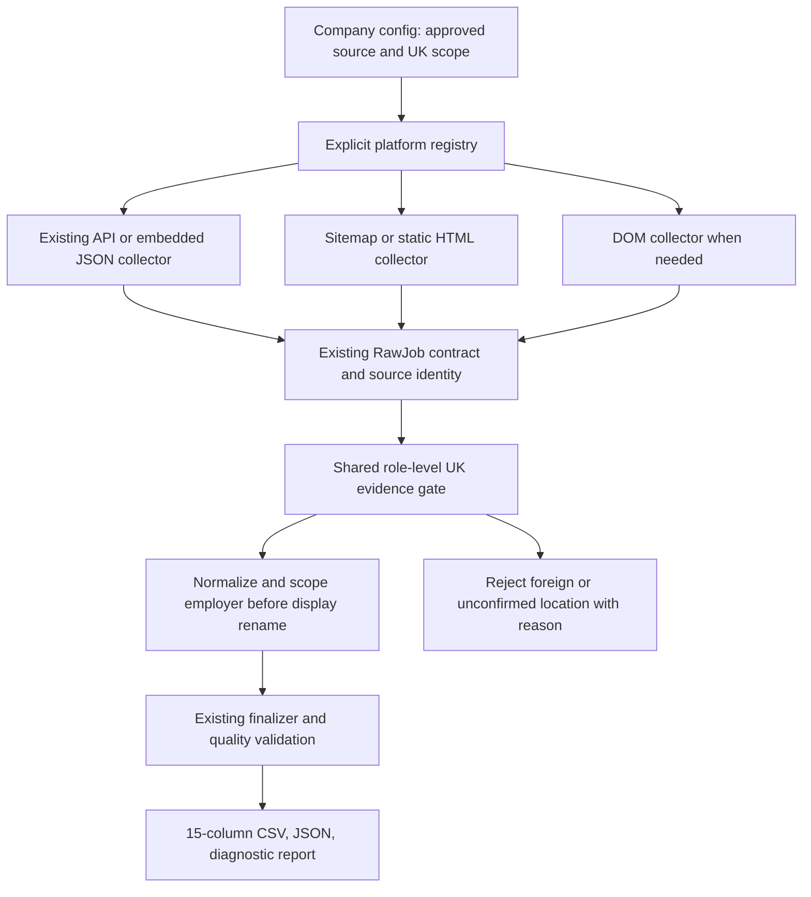

# UK-only universal scraper — proposed design

Status: reviewable design, implementation pending. User scope: consolidate supplied company scrapers using TypeScript/Node, preserve legitimate UK vacancy coverage and the existing output contract, exclude overseas/unknown-location roles and NHS Jobs, preserve originals until verified.

## Design choice

1. **Extend the current primary app (recommended).** Add a small company catalog and explicit platform registry around its existing collectors, extraction, geography, normalization, output and finalizer. Most supplied code is a copy of this engine. This minimizes replacement risk and avoids another independent framework.
2. **New parallel framework.** Cleaner boundary initially, but duplicates working parsing/policies and requires re-proving the dashboard/CLI/export integration. Reject unless existing interfaces prevent composition.
3. **Wrapper around all existing entrypoints.** Fast orchestration, but retains duplication, historical output writes, broken launchers, optional model judgments and inconsistent UK rules. Suitable only for isolated baseline capture; not the final universal engine.

The design uses approach 1. Existing APIs remain compatible; migrate one family at a time. Keep custom collectors only for demonstrated exceptions.

## Data flow



## Proposed source layout

```text
web_scrapper_project/
  universal.ts                 # CLI: one company / explicitly selected catalog
  src/
    companies.ts               # validated config catalog and scope metadata
    universal.ts               # registry dispatch + company scope + finishing
    platforms.ts               # small registry of existing collector functions
    strategy.ts                # existing API/static/DOM fallback orchestration
    comeet.ts, jobtrain.ts      # reuse existing implementations
    ats.ts                     # current API mappers; only proven families selected
    sitemap.ts, crawl.ts        # shared XML/HTML/DOM mechanisms and AccessPolicy
    extract.ts, wordpress.ts   # current extraction and WordPress feed discovery
    geography.ts, normalize.ts # role evidence and current RawJob/JobRow contract
    output.ts, final-dataset.ts # shared export validation and finalization
  config/companies.json        # maintained approved companies, declarative options
  tests/universal.test.ts      # catalog/dispatch/UK/identity/finishing behavior
  scripts/compare-scrapers.ts  # isolated old/new fixture difference reports
```

Do not create empty strategy/parser/logger classes. Move modules only when it removes an actual dependency problem. Keep registry selectors separate from the exported `ats` field, which the existing spreadsheet contract sets to `Custom`.

## Company configuration and exceptions

Reuse `BatchCompany`: name, slug, careersUrl, originalUrl, sourceNote, employerNames, titlePrefixes, exportCompanyName and current options. Add only explicit platform and reviewed scope/status metadata. Preserve selectors, explicit sitemap, API URL, request limits and source identity notes. Unknown/unreviewed configs fail selection visibly rather than returning an empty success.

Example target configuration (proposed interface):

```ts
{
  name: "Example UK employer",
  slug: "example-uk-employer",
  careersUrl: "https://www.comeet.com/jobs/example/XX.001/",
  platform: "comeet",
  country: "UK",
  options: { mode: "static" }
}
```

`country: "UK"` expresses the requested filter; it never supplies missing role country. Adding a source requires platform/schema evidence and the UK fixture gate. Preserve source identity before employer filtering and apply display-name overrides only afterwards. A shared/group board cannot establish scope using the configured fallback name.

Prefer current selector/options support and a small registered parser function for a real exception. Do not add generic beforeRequest/afterParse hooks without a demonstrated need. No raw remote JavaScript evaluation or arbitrary executable company config.

## UK-only policy

- Global employers can be configured, but only their role-specific UK jobs can export. Employer domicile and `.co.uk` alone are insufficient.
- Accept explicit UK country/nation or independently corroborated job address/postcode/settlement-region evidence under the current primary-app rules. An approved role-specific UK work-eligibility clause may qualify as defined by the runbook; generic footer/company text may not.
- Reject explicit foreign country before any inference. Unknown locations and globally unscoped remote roles stay excluded. Mixed-location jobs retain only source-confirmed UK bases; this must be tested before and after geography resolution.
- Model judgment alone cannot create UK evidence. Configured country must never replace source country. Every collector uses the same final UK evidence check, including custom adapters.
- Reject NHS Jobs sources/redirects/detail URLs throughout collection, not merely in the catalog. Technical legacy extraction support does not authorize them.
- Start from the 45 offline-checked candidates. Keep the other 30 out of the runnable catalog until their specific blockers and independent UK tests are resolved. This is an admission policy, not a claim of live support for 45 companies.

## Output and policy compatibility

Keep `RawJob`, `JobRow` and the existing 15 fields in their exact order: jobId, title, description, jobUrl, postedDate, jdDeadline, company, salaryRange, employmentType, worktype, location, city, state, country, ats. Preserve JSON/report diagnostics and empty unavailable fields. CSV validation and finalizer must control export readiness.

Use the current primary finishing path for new exports: source-backed IDs, source-only posting dates, annual GBP salary, unique vacancy rows with explicit joined locations. Comeet keeps the explicit user exception using `time_updated` as date basis and excludes missing/invalid updates. Do not weaken UK evidence to match legacy output.

Compare older behavior honestly: generated IDs, run-day fallbacks, older location splits and hardcoded foreign/unknown country assignments must be reported as policy corrections with record-level explanations. Compare pre-normalization source coverage separately from finalized output; legitimate UK source coverage must remain unchanged unless the source itself changed. Originals remain available for rollback.

## Collection efficiency

Reuse HTTP/API and embedded JSON before DOM. Start with sequential companies, consistent with the current project concurrency decision. Reuse one browser/context per crawl and always close in `finally`. Cross-company pooling is deferred until profiling shows need and isolation tests exist.

Centralize retries in `AccessPolicy`: cover 429/500/502/503/504 plus supported transient network/timeouts, bounded exponential backoff and Retry-After. Keep robots rules and per-origin pacing. Sharing a pacing context is necessary before concurrent companies on the same ATS origin are enabled; do not launch 70 browsers. Follow source totals/next links with cycle detection, optional explicit user budgets and the emergency ceiling; report unfinished pagination as partial.

## Migration sequence and stop conditions

1. Freeze isolated fixtures/source baselines and complete the written implementation plan after design review. Never execute historical self-running exporters against their original delivery paths. Capture from isolated temporary copies or parser fixtures with a fixed run time; redact credentials.
2. Add catalog, registry, shared company scoping and finalizer integration. Verify unsupported/held selection, NHS rejection, report preservation, output compatibility, and that display renames cannot bypass source identity.
3. Migrate 27 eligible Comeet configs first; preserve embedded JSON semantics, UID suffixes, update-date policy, demo exclusions and work-arrangement conflict notes. Old/new fixture comparison must account for every source position and every field difference.
4. Migrate 17 eligible Eploy-compatible configs using existing sitemap/details. Preserve custom canonical hosts, role-specific location precedence, group-employer filters and multi-location evidence. Test XML indexes, missing details and partial pagination.
5. Migrate CC Nurseries/Jobtrain with the current tenant/source-brand disclosure and detail API/HTML behavior.
6. Resolve five broken launchers as catalog migrations rather than blindly fixing/deleting old packages. UK validation and representative family comparisons are prerequisites for admission.
7. Assess held sources individually: Python-to-TypeScript extraction, WordPress/linked Reed, custom HTML/Next.js/JobAdder/Occy, and source identity blockers. Keep no-source/demo/wrong-employer records held; do not manufacture a generic engine for them.
8. Cut over only companies with passing fixture differences and disclosed live checks. Run representative live checks from every migrated mechanism; network-blocked companies remain implemented/unverified and cannot be counted as passed.
9. Remove only proven unused source implementations after traceable consumer checks, regressions and portability requirements are satisfied. Historical company deliveries stay unchanged. Generate standalone packages from the shared source when requested.
10. Run the complete suite before final migration report. Existing full-typecheck script errors need to be disclosed and resolved within separately authorized scope; no commit/push until the project's release gate passes.

For every comparison report: old/new source count, exported count, IDs/URLs, missing/unexpected records, per-field differences, duplicate collisions, missing fields, and annotated intentional policy differences. Multiple location rows require a source vacancy key as well as row comparison. A company with failed requests, pending pagination or unknown schema cannot be marked verified.

## Acceptance and remaining work

- Each selected company is configuration-driven; one engine per equivalent mechanism, small exceptions only where required.
- All exports are UK-evidence-checked and retain the downstream 15-column contract.
- Zero unexplained missing legitimate UK source jobs and zero unexplained identity/field differences on fixed fixtures.
- Live results clearly distinguish verified, partial, blocked, unavailable and implemented/unverified. Saved-file checks do not establish current live vacancy availability.
- Report all new/modified/deleted paths and calculate actual before/after runtime lines and duplication reduction. Audit duplicate lines are potential reuse, not savings already achieved.
- Run commands will be finalized during implementation: install `npm ci`, app build/typecheck, tests, `universal.ts --company <slug>`, and explicit approved-catalog all-company execution. No invented runnable command or unsupported-engine promise at design stage.

Current verified baseline: primary app typecheck passes; 125 unit tests pass. Audit-script typecheck and UK checks are recorded separately. No runtime migration, live company verification, regression comparison or deletion has occurred yet.
